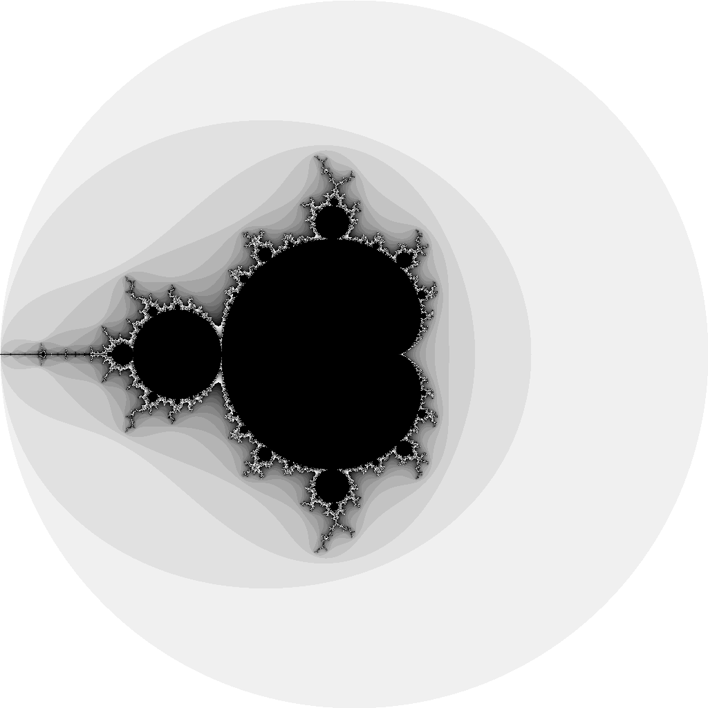

# parallel-processing-mandelbrot.go

🤠🤠🤠 Goで並列処理でマンデルブロ集合を描画してみる！  

  

## 実行方法

以下のコマンドでシングルスレッドとマルチスレッド処理のベンチマーク比較ができます！  

```shell
go test -bench .
```

実行結果は以下のようになります。  
※ MacBook Air (M2, 2022) での実行結果です。  

マルチスレッド(Goルーチンの使用)で2.5倍ほど高速化できました！  

```shell
goos: darwin
goarch: arm64
pkg: example.com
BenchmarkSimpleMain-8           1000000000               0.1818 ns/op
BenchmarkMultiMain-8            1000000000               0.07167 ns/op
PASS
ok      example.com     3.418s
```
